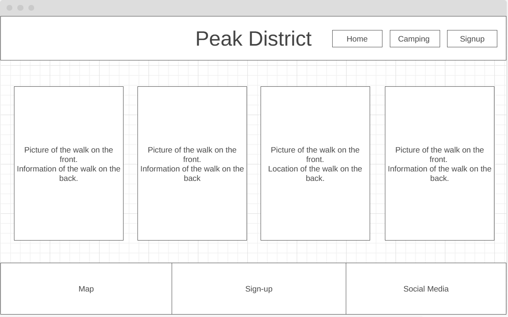
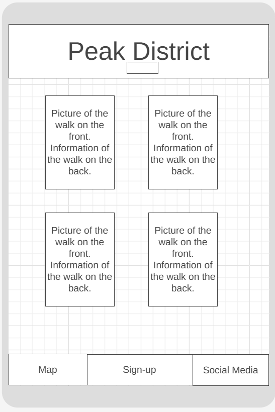

# The Peak District
## A website built for discovering walks and places to camp in The Peak District 
### MS1 - Christopher Moreton

## Table of contents

 1. [ UX ](#ux)
 2. [ Features ](#features)  
 3. [ Features Left to Implement ](#left)  
 4. [ Technology used ](#tech) 
 5. [ Testing ](#testing)  
 6. [ Bugs ](#bugs)  
 7. [ Deployment](#deployment)
 8. [ Credits](#credits)
 9. [ Content](#content)  
 10. [ Acknowledgements](#acknowledgements)  

 ## UX

 

 ### Pre-project Planning
> Before starting this project, I had my mind set on the idea of creating a responsive website revolving aorund the idea of walking and camping as this is a large passion of mine. When making my decision for this project, I completed some research on the current user market for websites involving top pics for walks and came up with ideas to make the website more user friendly and interative.

# UX design

## Strategy Plane

### To determine the best approach to this project I started with to determine the user and business needs.

## User Stories

### User
> As a user I would like quick suggestions on walks in the Peak District with timings and difficulty  
> As a user I would like to be able to sign up to regular updates on new walaks and camping locations 

## Scope Plane
> The website should have a Navigation menu that is consistent across all pages and devices.  
> The website should have a welcome message for the user explaining to them who we are and what we do.  
> The website should display walks and camping locations so the user can make quick decisions iin their next walk choice.  
> The website should allow the user ease of accsee and understanding.
> The website should allow for a way to keep up to date with regular changes and updates.
> The website should include a loation map so the user can visualise the location. 

## Structure Plane
> To achieve the above goals, the created website should include a navigation bar, this will include 3 navigation links (home, camping and signup), the signup page will take you to a thankyou page. The webstie incliudes a header, section and footer in which the map and social media links are contained.

**Home Page**
> The home page includes a navigation bar with links to each page.
> 4 flip cards with the weekly top pics for Peak District Walks.
> Footer showcasing a map, signup link and social media links.

**Camping**
> The camping page includes a centre picture with 4 flip cards which showcase the bes locations to camp for th chosen walks on the home page.   

**Sign-up**
> The sign-up page cosists of a form to fill out which includes; first name, last name, email address and radio button for preference choice. This form will generate a thankyou message once submitted.

## Skeleton Plane

### Home Page Desktop Wireframe

### Home Page mobile wireframe

> The deisgn I have implemented in the wire frame is in aim of making the website simple, responsive and uder friendly.
> THe original idea I had for the project regarding the flip cards has continued to be implemented in the final design as I believe it adds to make a more user friendly experience. 
>  THere will be colours implemented in my final design. The title will be coloured and will chsnge colour to indicate the cursor, along with the navigation items. The flip cards will flip to show more infomrmation regaring the walk on the back. The camping page will showcase a similar design to the home page in the use of flip cards.
