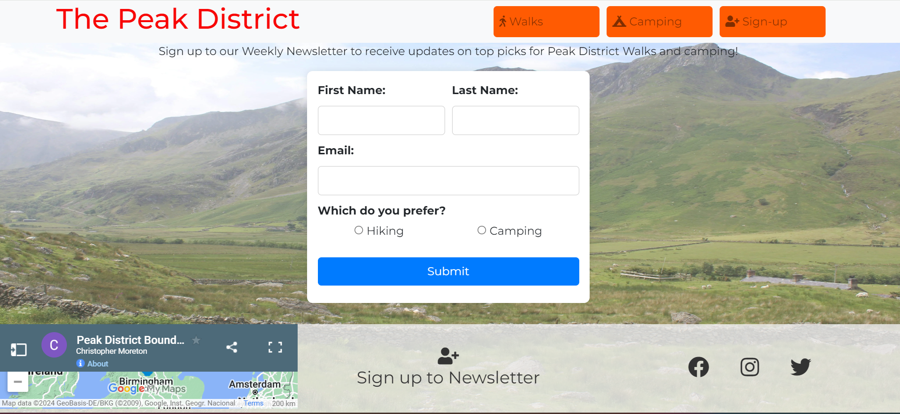

# The Peak District
## A website built for discovering walks and places to camp in The Peak District 
### MS1 - Christopher Moreton

## Table of contents

 1. [ UX ](#ux)
 2. [ Features ](#features)  
 3. [ Features Left to Implement ](#left)  
 4. [ Technology used ](#tech) 
 5. [ Testing ](#testing)  
 6. [ Bugs ](#bugs)  
 7. [ Deployment](#deployment)
 8. [ Credits](#credits)
 9. [ Content](#content)  
 10. [ Acknowledgements](#acknowledgements)  

 ## UX

 

 ### Pre-project Planning
> Before starting this project, I had my mind set on the idea of creating a responsive website revolving aorund the idea of walking and camping as this is a large passion of mine. When making my decision for this project, I completed some research on the current user market for websites involving top pics for walks and came up with ideas to make the website more user friendly and interative.

# UX design

## Strategy Plane

### To determine the best approach to this project I started with to determine the user and business needs.

## User Stories

### User
> As a user I would like quick suggestions on walks in the Peak District with timings and difficulty  
> As a user I would like to be able to sign up to regular updates on new walaks and camping locations 

## Scope Plane
> The website should have a Navigation menu that is consistent across all pages and devices.  
> The website should have a welcome message for the user explaining to them who we are and what we do.  
> The website should display walks and camping locations so the user can make quick decisions iin their next walk choice.  
> The website should allow the user ease of accsee and understanding.
> The website should allow for a way to keep up to date with regular changes and updates.
> The website should include a loation map so the user can visualise the location. 

## Structure Plane
> To achieve the above goals, the created website should include a navigation bar, this will include 3 navigation links (home, camping and signup), the signup page will take you to a thankyou page. The webstie incliudes a header, section and footer in which the map and social media links are contained.

**Home Page**
> The home page includes a navigation bar with links to each page.
> 4 flip cards with the weekly top pics for Peak District Walks.
> Footer showcasing a map, signup link and social media links.

**Camping**
> The camping page includes a centre picture with 4 flip cards which showcase the bes locations to camp for th chosen walks on the home page.   

**Sign-up**
> The sign-up page cosists of a form to fill out which includes; first name, last name, email address and radio button for preference choice. This form will generate a thankyou message once submitted.

## Skeleton Plane

### Home Page Desktop Wireframe

### Home Page mobile wireframe

> The deisgn I have implemented in the wire frame is in aim of making the website simple, responsive and user friendly.
> The original idea I had for the project regarding the flip cards has continued to be implemented in the final design as I believe it adds to make a more user friendly experience. 
>  THere will be colours implemented in my final design. The title will be coloured and will chsnge colour to indicate the cursor, along with the navigation items. The flip cards will flip to show more infomrmation regaring the walk on the back. The camping page will showcase a similar design to the home page in the use of flip cards.

## Surface Plane

### Color
> I decided for this project that to make it stand out and to give the users an enjoyalbe expeirence, that color was required. I used a variety of colours and hover colors on this project in aim of letting the page pop.

> The decision on colors that I made was to incorporate. 

 - #f80404-red
 - #ff5b02-orange
 - #deb887-burlywood
 - #d1c43b-yellow
 - #333-black
 - ##007bff-blue
These colors allow each part of my page to stand out and allow the user to visualise a diffetnet color when hovring over a clickable item.
>The images within this project allow for a variety of diffetent colors which alows them to stand out from the page.
>During the building of this project, I initially set the opacitiy of the background color too dak which did not allow for much color to be seen. This was edited to allow more color to come through.

### Typography - 

>The font's chosen for this project were:

 - Montserrat
 - Back-up - sans-serif
> The idea behind this choice was to allow for a hint of modernism but also allow for user readability.
> The back-up font allows for sans-serif to be used if montserrat is not available on particular browsers.

## Features

### index.html

#### Navigation Bar

> Navigation Bar developed using Flex and bootstrap container, navigation bar contains three links to the right of the title, the title and the walk navigation element both link back to the index.html home page. The first image is the standard desktop navigation bar. THe second image is the navigation bar viewed on a mobile device.

#### Hero Section

> Image section with 3 flip cards, the front of the flip cards showcase locations in the Peak District with ratings similar to that of trump cards. The back of the flip cards show an active google maps review of the location using i-frame.

#### Footer

> Bootstrap and custom style footer used to showcase a map location of the Peak District with the use of i-frame to the left side. The middle of the footer allows for the user to be taken to the sign-up page. The right side of the footer showcases media icons. I decided that a map to show the whole outline of the Peak District would allow new users to gain an understanding of the size and potential the Peak District has.

### camping.html

#### Camping

> The camping section is a showcase of four different campsites that are suitable to camp in for the wlks on the index.html walk page. This allows the users to be able to find suitable camping locations if they embark on one of the suggested walks.

### form.html

#### Form

> The form page is created to allow users to sign-up to the weekly newsletter and updates on the webstie for new suggested walks and camping locations. The submission of the form brings up a thankyou message as I have not created any backend for this form. Thae thankyou is to allow users to know that the form has been submitted. In the future I would like to add back end to this form with the option to also contact the site.
>Initially, this form did not have a radio button selection to allow users to select wha tthye are most using this weksite for, this was updated to allow for a selection button to be clicked before submission of the form.
>The sign-up form is minimilistic in its colors but does have a blue submit button whic his used to stand out to the users.
#### Form Thankyou

> This is the thankyou notice to the users that sign-up.

### Additional Page ideas
>I would like to add a page specifically designated to users photos of their experiencs in the Peak District and their ratings of each location.

# Technology Used

### Html
> Used to structure my webpages and the bones of any web project

### CSS
> Used to style and add layout to my project.

### Font Awesome
> Used for all the icons in this project

### GoogleFonts
> Used for the fonts in this project and comparison potential fonts.

### Online-Convert.com
> Used to convert files from png to webp to reduce size and improve web loading speed.

### Pexels.com
> Used for royalty free images for my webpage.

### Bootsrtap
> Used for styling some of my webpage (header and ooter)

### JavaScript
> Used for styling the flip cards on the walks and camping page.

### My Maps
> Used for the i-frames to import google maps onto my site.

### W3 Schools
> Used for obtaining code for JavaScript flip cards. Used for checking the vlidation of HTML and CSS.

### Lighthouse
> Used to check the perforance, accessibliy and best practices of my site.

# Testing
> Testing on this site was primarily complted by myself. A couple of friends and a family member chekced over the site to find any problems.

### Testing Phase

**Testing for links and Form**
| Test |Outcome  |
|--|--|
|All links on Navigation lead to their correct pages| Pass  |
|Sign-up to newsletter links to the form page| Pass
|Footer social links all lead to their respective social media sites |Pass|
|Contact form submits when all criteria is filled correctly and leads to a thankyou page| Pass  |
|User prevented from submitting form without correct elements| Pass|
|Form Validation presents when incorrect input type is entered |Pass|

**Testing for responsiveness**
| Test |Outcome  |
|--|--|
|Home page, camping page, sign-up page all display the content in a visible manner on larger screens|Pass |
|Home page, camping page, sign-up page all display the content in a visible manner on smaller screens|Pass |
    
### User testing

**User testing Challenge**

> 3 users are given basic tasks whilst visiting the web page to test for ease of use.

| Test | Result |
|--|--|
|When entering the site, navigate to the sign up page.| 100%|
|Please navigate to the twitter link|100%  |
|Please navigate to the camping page and inform me of the rating for Mam Tor| 100%|
|Please fill in the sign-up form and submit the form| 100%  |

## Google Lighthouse Testing

### index.html

### camping.html

### form.html

### form-thankyou.html

## HTML Validation

### index.html

#### Result: No Errors

### camping.html

#### Result: No Errors

### form.html

#### Result: No Errors, 1 warning about the section not having a heading.

### form-thankyou.html

#### Result: No Errors, 1 warning about the section not having a heading.

